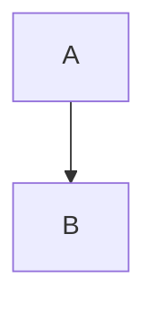

# Phase 520: Agents Check - Content

**Root Feature:** `quench-014b`

## Overview

Implement content validation rules for the `agents` check. This phase adds:
- Markdown table detection and `tables = "forbid"` enforcement
- Box diagram detection (┌─┐ style ASCII art)
- Mermaid code block detection
- Size limits (`max_lines`, `max_tokens`) per scope

Key capabilities:
- Line-by-line content scanning for forbidden patterns
- Per-scope size limit configuration (root/package/module)
- Token estimation using `chars / 4` for fast checks
- Violation output with line numbers for content issues

## Project Structure

```
crates/cli/src/
├── checks/
│   ├── agents/
│   │   ├── mod.rs           # Add content validation to run()
│   │   ├── config.rs        # Add tables, box_diagrams, mermaid, max_lines, max_tokens
│   │   ├── config_tests.rs  # Tests for content config parsing
│   │   ├── content.rs       # NEW: Content validation logic
│   │   ├── content_tests.rs # NEW: Unit tests for content detection
│   │   ├── sections.rs      # Unchanged
│   │   ├── sync.rs          # Unchanged
│   │   └── detection.rs     # Unchanged
│   └── mod.rs
├── config/
│   └── parse.rs             # Parse content rules from TOML
tests/
├── fixtures/agents/
│   ├── with-table/          # Already exists
│   ├── oversized-lines/     # Already exists
│   ├── oversized-tokens/    # Already exists
│   ├── with-box-diagram/    # NEW: Box diagram test
│   └── with-mermaid/        # NEW: Mermaid block test
└── specs/checks/agents.rs   # Enable content specs
```

## Dependencies

No new external dependencies. Uses:
- `std::fs` for file reading
- Existing regex-free line-by-line parsing (pattern matching with `str` methods)

## Implementation Phases

### Phase 1: Configuration Schema Update

Add content rule configuration fields to `AgentsConfig`.

**Tasks:**
1. Add `tables`, `box_diagrams`, `mermaid` fields with `ContentRule` enum
2. Add `max_lines`, `max_tokens` fields to top-level config
3. Inherit scope-level `max_lines`, `max_tokens` from existing `AgentsScopeConfig`
4. Add unit tests for config parsing

**Content rule enum in `config.rs`:**
```rust
/// Content rule enforcement level.
#[derive(Debug, Clone, Copy, Default, PartialEq, Eq)]
pub enum ContentRule {
    /// Allow this content type.
    Allow,
    /// Forbid this content type (generate violation).
    #[default]
    Forbid,
}

impl<'de> Deserialize<'de> for ContentRule {
    fn deserialize<D>(deserializer: D) -> Result<Self, D::Error>
    where
        D: Deserializer<'de>,
    {
        let s = String::deserialize(deserializer)?;
        match s.as_str() {
            "allow" => Ok(ContentRule::Allow),
            "forbid" => Ok(ContentRule::Forbid),
            _ => Err(serde::de::Error::custom(format!(
                "invalid content rule: {}, expected 'allow' or 'forbid'",
                s
            ))),
        }
    }
}
```

**Updated AgentsConfig fields:**
```rust
pub struct AgentsConfig {
    // ... existing fields ...

    /// Markdown table enforcement (default: forbid).
    #[serde(default)]
    pub tables: ContentRule,

    /// Box diagram enforcement (default: allow).
    #[serde(default = "ContentRule::allow")]
    pub box_diagrams: ContentRule,

    /// Mermaid block enforcement (default: allow).
    #[serde(default = "ContentRule::allow")]
    pub mermaid: ContentRule,

    /// Maximum lines per file (root scope, use false/0 to disable).
    #[serde(default)]
    pub max_lines: Option<usize>,

    /// Maximum tokens per file (root scope, use false/0 to disable).
    #[serde(default)]
    pub max_tokens: Option<usize>,
}

impl ContentRule {
    pub fn allow() -> Self {
        ContentRule::Allow
    }
}
```

**Verification:**
```bash
cargo test checks::agents::config::tests
```

### Phase 2: Content Detection Logic

Create content detection functions for tables, box diagrams, and mermaid blocks.

**Tasks:**
1. Create `crates/cli/src/checks/agents/content.rs`
2. Implement markdown table detection
3. Implement box diagram detection
4. Implement mermaid block detection
5. Add unit tests in `content_tests.rs`

**Content detection in `content.rs`:**
```rust
/// A detected content issue.
#[derive(Debug)]
pub struct ContentIssue {
    /// Line number where the issue starts.
    pub line: u32,
    /// Type of content detected.
    pub content_type: ContentType,
}

#[derive(Debug, Clone, Copy)]
pub enum ContentType {
    MarkdownTable,
    BoxDiagram,
    MermaidBlock,
}

impl ContentType {
    pub fn violation_type(&self) -> &'static str {
        match self {
            ContentType::MarkdownTable => "forbidden_table",
            ContentType::BoxDiagram => "forbidden_diagram",
            ContentType::MermaidBlock => "forbidden_mermaid",
        }
    }

    pub fn advice(&self) -> &'static str {
        match self {
            ContentType::MarkdownTable => {
                "Tables are not token-efficient. Convert to a list or prose."
            }
            ContentType::BoxDiagram => {
                "Box diagrams are not token-efficient. Use a simple list or description."
            }
            ContentType::MermaidBlock => {
                "Mermaid diagrams are not token-efficient. Use a simple list or description."
            }
        }
    }
}

/// Scan content for markdown tables.
///
/// A markdown table is detected when:
/// - A line starts with `|` and ends with `|`
/// - Followed by a separator line with `|` and dashes
pub fn detect_tables(content: &str) -> Vec<ContentIssue> {
    let mut issues = Vec::new();
    let lines: Vec<&str> = content.lines().collect();

    for (i, line) in lines.iter().enumerate() {
        let trimmed = line.trim();

        // Check for table header row: | col | col |
        if trimmed.starts_with('|') && trimmed.ends_with('|') && trimmed.contains(" | ") {
            // Check if next line is a separator: |---|---|
            if let Some(next_line) = lines.get(i + 1) {
                let next_trimmed = next_line.trim();
                if next_trimmed.starts_with('|')
                    && next_trimmed.contains('-')
                    && next_trimmed.ends_with('|')
                {
                    issues.push(ContentIssue {
                        line: (i + 1) as u32, // 1-indexed
                        content_type: ContentType::MarkdownTable,
                    });
                }
            }
        }
    }

    issues
}

/// Scan content for box diagrams (ASCII art with box-drawing characters).
///
/// Detects lines containing Unicode box-drawing characters:
/// ┌ ┐ └ ┘ │ ─ ├ ┤ ┬ ┴ ┼
pub fn detect_box_diagrams(content: &str) -> Vec<ContentIssue> {
    let mut issues = Vec::new();
    let box_chars = ['┌', '┐', '└', '┘', '│', '─', '├', '┤', '┬', '┴', '┼'];

    for (i, line) in content.lines().enumerate() {
        // Check for box-drawing characters (need at least 2 to be a diagram)
        let box_count = line.chars().filter(|c| box_chars.contains(c)).count();
        if box_count >= 2 {
            issues.push(ContentIssue {
                line: (i + 1) as u32,
                content_type: ContentType::BoxDiagram,
            });
            // Only report first occurrence per file to avoid noise
            break;
        }
    }

    issues
}

/// Scan content for mermaid code blocks.
///
/// Detects ```mermaid fenced code blocks.
pub fn detect_mermaid_blocks(content: &str) -> Vec<ContentIssue> {
    let mut issues = Vec::new();

    for (i, line) in content.lines().enumerate() {
        let trimmed = line.trim();
        if trimmed.starts_with("```mermaid") || trimmed.starts_with("~~~mermaid") {
            issues.push(ContentIssue {
                line: (i + 1) as u32,
                content_type: ContentType::MermaidBlock,
            });
        }
    }

    issues
}
```

**Verification:**
```bash
cargo test checks::agents::content::tests
```

### Phase 3: Size Limit Validation

Implement line count and token estimation checks.

**Tasks:**
1. Add size checking functions to `content.rs`
2. Implement line counting
3. Implement token estimation (`chars / 4`)
4. Generate `file_too_large` violations with threshold info

**Size validation in `content.rs`:**
```rust
/// Size limit violation details.
#[derive(Debug)]
pub struct SizeViolation {
    /// Whether this is a line count or token count violation.
    pub limit_type: SizeLimitType,
    /// Actual value found.
    pub value: usize,
    /// Configured threshold.
    pub threshold: usize,
}

#[derive(Debug, Clone, Copy)]
pub enum SizeLimitType {
    Lines,
    Tokens,
}

impl SizeLimitType {
    pub fn advice(&self, value: usize, threshold: usize) -> String {
        match self {
            SizeLimitType::Lines => format!(
                "File has {} lines (max: {}). Split into smaller files or reduce content.",
                value, threshold
            ),
            SizeLimitType::Tokens => format!(
                "File has ~{} tokens (max: {}). Reduce content for token efficiency.",
                value, threshold
            ),
        }
    }
}

/// Check if content exceeds the line limit.
pub fn check_line_count(content: &str, max_lines: usize) -> Option<SizeViolation> {
    let line_count = content.lines().count();
    if line_count > max_lines {
        Some(SizeViolation {
            limit_type: SizeLimitType::Lines,
            value: line_count,
            threshold: max_lines,
        })
    } else {
        None
    }
}

/// Check if content exceeds the token limit.
///
/// Uses chars / 4 as a fast approximation.
pub fn check_token_count(content: &str, max_tokens: usize) -> Option<SizeViolation> {
    let token_estimate = content.chars().count() / 4;
    if token_estimate > max_tokens {
        Some(SizeViolation {
            limit_type: SizeLimitType::Tokens,
            value: token_estimate,
            threshold: max_tokens,
        })
    } else {
        None
    }
}
```

**Verification:**
```bash
cargo test checks::agents::content::tests::size
```

### Phase 4: Integration with Agents Check

Integrate content validation into `AgentsCheck::run()`.

**Tasks:**
1. Add `mod content` to `mod.rs`
2. Create `check_content()` function
3. Generate violations for forbidden content types
4. Generate violations for size limit exceedance
5. Respect per-scope configuration inheritance

**Integration in `mod.rs`:**
```rust
mod content;

use content::{
    ContentIssue, ContentType, SizeLimitType,
    detect_tables, detect_box_diagrams, detect_mermaid_blocks,
    check_line_count, check_token_count,
};
use config::ContentRule;

fn run(&self, ctx: &CheckContext) -> CheckResult {
    // ... existing validation ...

    // Check content rules in each detected file
    check_content(ctx, config, &detected, &mut violations);

    // ... rest of run() ...
}

/// Check content rules in agent files.
fn check_content(
    _ctx: &CheckContext,
    config: &AgentsConfig,
    detected: &[DetectedFile],
    violations: &mut Vec<Violation>,
) {
    for file in detected {
        let Ok(content) = std::fs::read_to_string(&file.path) else {
            continue;
        };

        let filename = file
            .path
            .file_name()
            .map(|n| n.to_string_lossy().to_string())
            .unwrap_or_default();

        // Get effective limits for this scope
        let (max_lines, max_tokens) = get_scope_limits(config, file.scope);

        // Check content rules
        if config.tables == ContentRule::Forbid {
            for issue in detect_tables(&content) {
                violations.push(Violation::file(
                    &filename,
                    issue.line,
                    issue.content_type.violation_type(),
                    issue.content_type.advice(),
                ));
            }
        }

        if config.box_diagrams == ContentRule::Forbid {
            for issue in detect_box_diagrams(&content) {
                violations.push(Violation::file(
                    &filename,
                    issue.line,
                    issue.content_type.violation_type(),
                    issue.content_type.advice(),
                ));
            }
        }

        if config.mermaid == ContentRule::Forbid {
            for issue in detect_mermaid_blocks(&content) {
                violations.push(Violation::file(
                    &filename,
                    issue.line,
                    issue.content_type.violation_type(),
                    issue.content_type.advice(),
                ));
            }
        }

        // Check size limits
        if let Some(limit) = max_lines {
            if let Some(violation) = check_line_count(&content, limit) {
                violations.push(
                    Violation::file_only(
                        &filename,
                        "file_too_large",
                        violation.limit_type.advice(violation.value, violation.threshold),
                    )
                    .with_threshold(violation.value as i64, violation.threshold as i64),
                );
            }
        }

        if let Some(limit) = max_tokens {
            if let Some(violation) = check_token_count(&content, limit) {
                violations.push(
                    Violation::file_only(
                        &filename,
                        "file_too_large",
                        violation.limit_type.advice(violation.value, violation.threshold),
                    )
                    .with_threshold(violation.value as i64, violation.threshold as i64),
                );
            }
        }
    }
}

/// Get effective size limits for a scope, with inheritance.
fn get_scope_limits(config: &AgentsConfig, scope: Scope) -> (Option<usize>, Option<usize>) {
    let scope_config = match scope {
        Scope::Root => config.root.as_ref(),
        Scope::Package => config.package.as_ref(),
        Scope::Module => config.module.as_ref(),
    };

    // Scope config overrides top-level, top-level provides defaults
    let max_lines = scope_config
        .and_then(|s| s.max_lines)
        .or(config.max_lines);

    let max_tokens = scope_config
        .and_then(|s| s.max_tokens)
        .or(config.max_tokens);

    (max_lines, max_tokens)
}
```

**Verification:**
```bash
cargo test checks::agents
```

### Phase 5: Test Fixtures and Behavioral Specs

Create additional fixtures and enable behavioral specs.

**Tasks:**
1. Verify existing fixtures work (`with-table`, `oversized-lines`, `oversized-tokens`)
2. Create `with-box-diagram` fixture
3. Create `with-mermaid` fixture
4. Remove `#[ignore]` from Phase 520 specs
5. Add new specs for box diagrams and mermaid

**New fixture: `tests/fixtures/agents/with-box-diagram/quench.toml`:**
```toml
version = 1

[check.agents]
box_diagrams = "forbid"
```

**New fixture: `tests/fixtures/agents/with-box-diagram/CLAUDE.md`:**
```markdown
# Project

This file contains a box diagram.

## Structure

┌─────────┐
│  Main   │
└─────────┘
```

**New fixture: `tests/fixtures/agents/with-mermaid/quench.toml`:**
```toml
version = 1

[check.agents]
mermaid = "forbid"
```

**New fixture: `tests/fixtures/agents/with-mermaid/CLAUDE.md`:**
````markdown
# Project

This file contains a mermaid diagram.

## Flow


````

**Enable specs in `tests/specs/checks/agents.rs`:**

Remove `#[ignore = "TODO: Phase 520 - Agents Content Rules"]` from:
- `agents_markdown_table_generates_violation`
- `agents_file_over_max_lines_generates_violation`
- `agents_file_over_max_tokens_generates_violation`

**Add new specs:**
```rust
/// Spec: docs/specs/checks/agents.md#box-diagrams
///
/// > Box diagrams generate a violation when box_diagrams = "forbid".
#[test]
fn agents_box_diagram_generates_violation() {
    let agents = check("agents").on("agents/with-box-diagram").json().fails();
    let violations = agents.require("violations").as_array().unwrap();

    assert!(
        violations
            .iter()
            .any(|v| v.get("type").and_then(|t| t.as_str()) == Some("forbidden_diagram")),
        "should have forbidden_diagram violation"
    );
}

/// Spec: docs/specs/checks/agents.md#mermaid
///
/// > Mermaid blocks generate a violation when mermaid = "forbid".
#[test]
fn agents_mermaid_block_generates_violation() {
    let agents = check("agents").on("agents/with-mermaid").json().fails();
    let violations = agents.require("violations").as_array().unwrap();

    assert!(
        violations
            .iter()
            .any(|v| v.get("type").and_then(|t| t.as_str()) == Some("forbidden_mermaid")),
        "should have forbidden_mermaid violation"
    );
}

/// Spec: docs/specs/checks/agents.md#size-limits
///
/// > Violations include value and threshold in JSON output.
#[test]
fn agents_size_violation_includes_threshold() {
    let agents = check("agents").on("agents/oversized-lines").json().fails();
    let violations = agents.require("violations").as_array().unwrap();

    let size_violation = violations
        .iter()
        .find(|v| v.get("type").and_then(|t| t.as_str()) == Some("file_too_large"));

    assert!(size_violation.is_some(), "should have file_too_large violation");

    let v = size_violation.unwrap();
    assert!(v.get("value").is_some(), "should have value field");
    assert!(v.get("threshold").is_some(), "should have threshold field");
}
```

**Verification:**
```bash
cargo test --test specs agents
```

## Key Implementation Details

### Markdown Table Detection

Tables are detected by looking for the characteristic pattern:
1. Header row: `| col | col |` (starts and ends with `|`, contains ` | `)
2. Separator row: `|---|---|` (starts and ends with `|`, contains `-`)

This avoids false positives from single pipes in prose or code blocks.

### Box Diagram Detection

Unicode box-drawing characters are distinctive:
- `┌ ┐ └ ┘` for corners
- `│ ─` for lines
- `├ ┤ ┬ ┴ ┼` for intersections

Detection requires at least 2 box characters on a line to avoid false positives.
Only the first occurrence is reported to reduce noise.

### Token Estimation

Token count is estimated as `chars / 4`:
- Fast: No external tokenizer dependency
- Reasonable accuracy: GPT-style tokenizers average ~4 chars per token
- Slight overestimate for ASCII, underestimate for CJK (acceptable for linting)

### Scope Configuration Inheritance

Size limits follow this precedence:
1. Scope-specific config (`[check.agents.root].max_lines`)
2. Top-level config (`[check.agents].max_lines`)
3. No limit (disabled)

This allows setting a global default with scope-specific overrides.

### Default Values

| Setting | Default |
|---------|---------|
| `tables` | `"forbid"` |
| `box_diagrams` | `"allow"` |
| `mermaid` | `"allow"` |
| `max_lines` | None (disabled) |
| `max_tokens` | None (disabled) |

Tables are forbidden by default because they are verbose and not token-efficient.
Diagrams are allowed by default because they can be useful in some contexts.

## Verification Plan

### Unit Tests

```bash
# Configuration parsing
cargo test checks::agents::config::tests

# Content detection
cargo test checks::agents::content::tests

# Full agents check
cargo test checks::agents
```

### Behavioral Specs

```bash
# Run agents specs (should pass after implementation)
cargo test --test specs agents

# Show remaining ignored specs
cargo test --test specs agents -- --ignored
```

### Full Validation

```bash
make check
```

### Acceptance Criteria

1. Markdown tables detected with line numbers
2. `tables = "forbid"` generates `forbidden_table` violation
3. Box diagrams detected when `box_diagrams = "forbid"`
4. Mermaid blocks detected when `mermaid = "forbid"`
5. `max_lines` enforced with `file_too_large` violation
6. `max_tokens` enforced with `file_too_large` violation
7. Violations include `value` and `threshold` fields
8. Per-scope limits override top-level limits
9. All Phase 520 behavioral specs pass
10. `make check` passes

## Spec Status (After Implementation)

| Spec | Status |
|------|--------|
| agents_detects_claude_md_at_project_root | ✅ Pass (505) |
| agents_detects_cursorrules_at_project_root | ✅ Pass (505) |
| agents_passes_on_valid_project | ✅ Pass (505) |
| agents_missing_required_file_generates_violation | ✅ Pass (505) |
| agents_forbidden_file_generates_violation | ✅ Pass (505) |
| agents_out_of_sync_generates_violation | ✅ Pass (510) |
| agents_fix_syncs_files_from_sync_source | ✅ Pass (510) |
| agents_missing_section_generates_violation_with_advice | ✅ Pass (515) |
| agents_forbidden_section_generates_violation | ✅ Pass (515) |
| agents_forbidden_section_glob_matches | ✅ Pass (515) |
| agents_markdown_table_generates_violation | ✅ Pass |
| agents_file_over_max_lines_generates_violation | ✅ Pass |
| agents_file_over_max_tokens_generates_violation | ✅ Pass |
| agents_box_diagram_generates_violation | ✅ Pass |
| agents_mermaid_block_generates_violation | ✅ Pass |
| agents_size_violation_includes_threshold | ✅ Pass |
| agents_json_includes_files_found_and_in_sync_metrics | ✅ Pass (505) |
| agents_violation_type_is_valid | ✅ Pass (510) |
